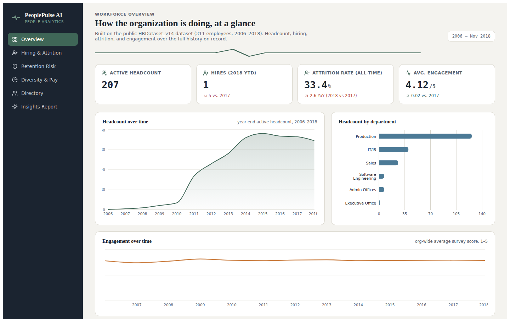

# PeoplePulse AI

AI-powered people analytics for modern teams — a full-stack-feeling dashboard that turns raw HR data into hiring, retention, diversity, and engagement insights.

Built on the public **[HRDataset_v14](https://rpubs.com/rhuebner/hrd_cb_v14)** dataset (311 employee records, 2006–2018), created by Dr. Carla Patalano and Dr. Rich Huebner for HR analytics education. No real employee data is used.

**[Live demo →](https://anlatted.github.io/peoplepulse-ai/)** *(add your GitHub Pages link here once deployed)*



## What it does

- **Overview** — headcount, hiring, attrition, and engagement trends across the full 2006–2018 history
- **Hiring & Attrition** — yearly hires vs. departures, department-level breakdowns
- **Retention Risk** — a transparent, rule-based attrition-risk score built from engagement survey results, satisfaction, performance rating, attendance, and tenure
- **Diversity & Pay** — gender and race/ethnicity composition, pay-equity ratios, department-level representation
- **Directory** — a searchable, filterable employee table
- **Insights Report** — a rule-based insight engine that reads the live dashboard numbers and drafts an executive-style Summary / Key Findings / Recommendations report, entirely client-side

## Why it's built this way

This is meant to be a portfolio piece you can link to and have actually load and work for anyone, so a couple of deliberate choices:

- **All data processing happens in the browser.** There's no backend, no database, and no API keys to configure — clone it, `npm install`, `npm run build`, and it runs anywhere static files can be served (including GitHub Pages).
- **The "Insights Report" tab doesn't call an external AI model.** Calling a real LLM from a public static site would mean baking your API key into client-side JavaScript, which isn't safe. Instead it uses a small local rules engine (see `generateLocalReport` in `src/App.jsx`) that reads the same numbers on screen and writes them up in the same Summary/Findings/Recommendations format. If you want a genuinely live LLM-generated report, see [Wiring up a real LLM call](#wiring-up-a-real-llm-call-optional) below.

## Tech stack

React 18 · Vite · Recharts · lucide-react

## Running locally

```bash
npm install
npm run dev       # dev server with hot reload
npm run build     # production build → dist/
npm run preview   # preview the production build locally
```

## Deploying to GitHub Pages

1. Push this project to a new GitHub repository.
2. In the repo, go to **Settings → Pages** and set **Source** to **GitHub Actions**.
3. Push to `main` (or run the workflow manually from the **Actions** tab). The included workflow (`.github/workflows/deploy.yml`) builds the app and publishes `dist/` automatically.
4. Your site will be live at `https://<your-username>.github.io/<repo-name>/`.

`vite.config.js` uses `base: "./"` (relative asset paths), so this works regardless of the repository name — no extra configuration needed.

## Replacing the dataset with your own

Swap `src/data/employees.json` for your own export. Each record should look like:

```json
{
  "id": "E10026",
  "name": "Last, First",
  "position": "Job Title",
  "department": "Department Name",
  "sex": "M",
  "race": "White",
  "hireDate": "2011-07-05",
  "termDate": null,
  "terminated": false,
  "termReason": null,
  "employmentStatus": "Active",
  "performanceScore": "Exceeds",
  "engagementSurvey": 4.6,
  "empSatisfaction": 5,
  "salary": 62506,
  "absences": 1,
  "daysLateLast30": 0,
  "specialProjectsCount": 0,
  "recruitmentSource": "LinkedIn",
  "managerName": "Manager Name"
}
```

Then update the `AS_OF` constant near the top of `src/App.jsx` to match the "as of" date for your data, and adjust the `computeRisk` weights if your engagement/satisfaction scales differ.

## Wiring up a real LLM call (optional)

If you deploy this somewhere with a backend (Vercel, Netlify, Cloudflare Pages with Functions, etc.) instead of plain GitHub Pages, you can replace `generateLocalReport()` in `src/App.jsx` with a `fetch` call to a serverless function you control, which in turn calls the Anthropic API with your key kept server-side. Never call `api.anthropic.com` directly from client-side code with an embedded key — it will be visible to anyone who opens dev tools.

## License

MIT for the code. The dataset is publicly available for educational/analytics use; see the source link above for its original terms.
# peoplepulse-ai
